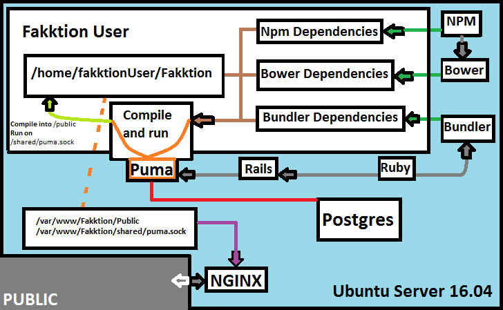

## Ubuntu Server 16.04 Server Maintenance (**WIP**)

## Server Overall Structure

#### Local DB


#### Remote DB


### Updating Project Source Code without moving database or changing servers.
1. Make a database backup if you have not done so. For local DBs, you should create a database dump as described on the [official Docs](http://www.postgresql.org/docs/9.1/static/backup.html).
2. Select an option of project update:
  - If running a surface update (e.g Source code changes), then run From docs folder ```./u16maintenance.sh 1 USER```.
  - If running a deep update (e.g Update project dependencies), then run From docs folder ```./u16maintenance.sh 2 USER```.

### Updating Project Source Code with database changes or between Servers.

**DO NOT MOVE DATABASE WITH PENDING MIGRATIONS!** If you do have pending migrations, you must follow the normal updating guide before following this guide otherwise you will risk desync schemas!

1. Make a DB backup!
2. Run from docs folder ```./u16maintenance.sh 3 USER```.
3. Copy **/home/USER/Fakktion_backup** to the new machine.
4. Follow the initial deploy guide until step 7, then run ```./u16maintenance.sh 4 USER``` instead of step 8.
5. Keep on following the deployment steps until 11, then run  ```./u16maintenance.sh 5 USER restorePuma? restorePreviousSecrets?``` instead of step 12.
6. Finish following the guide.
7. Stop PUMA with ```service puma stop```.
8. Recover your DB
9. Start PUMA with ```service puma start```.
10. Voila!

### Checking Logs
1. Puma Cluster log available under app/log/puma.log
2. Puma Stdout and Puma Stdeer logs available under app/shared/log

### Check running PUMA apps
```ps aux | grep puma```

### Manually Running puma
```bundle exec puma -e production -d -b unix:///home/USER/Fakktion/shared/sockets/puma.sock```

### Remove app from PUMA
```sudo /etc/init.d/puma remove /path/to/app```

